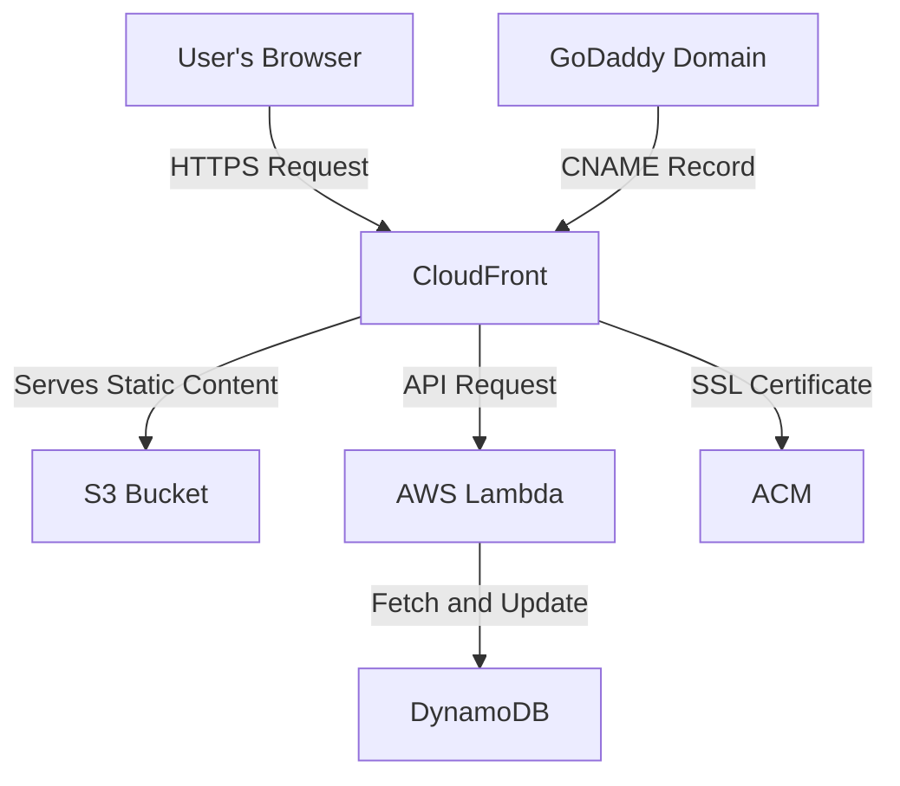

# Cloud Resume Challenge 
This repository documents the process of creating a Cloud Resume using serverless architecture, cloud technologies, and modern web practices. Below are the steps and components used to build this project.

# Features
- **Static Resume Website:** Hosted on an S3 bucket and distributed globally via CloudFront.
- **Custom Domain:** The website is accessible at https://www.kolton.cloud with HTTPS enabled.
- **Serverless Backend:** A Lambda function handles API requests to update and retrieve the visitor count.
# Technologies Used
### **Frontend:**
- HTML/CSS/JavaScript for the static resume.
- Visitor count dynamically displayed using JavaScript.
### **Backend:**
- AWS Lambda: Processes requests to fetch and update visitor count.
- DynamoDB: Stores the visitor count.
### **Infrastructure:**
- S3: Hosts the static website files.
- CloudFront: Provides global distribution with caching.
- GoDaddy: Manages the custom domain kolton.cloud.
- ACM: Provides the SSL certificate for HTTPS.

# Architecture Diagram

This diagram shows the tech stack and workflow for the Cloud Resume project:



# Step-by-Step Process
## 1. Frontend Development
- Create a static resume using HTML, CSS, and JavaScript.
Add a placeholder <span id="viewer-count"></span> for the visitor count in the HTML.
## 2. Hosting Static Website
- **S3 Setup:**
Create an S3 bucket named cloud-resume-kolton.
Enable static website hosting.
Upload your resume files (e.g., index.html, style.css, index.js).
- **CloudFront Setup:**
Create a CloudFront distribution pointing to your S3 bucket.
Add an Origin Request Policy to forward Origin headers.
## 3. Setting Up Custom Domain
- **GoDaddy:**
Purchase and configure the domain kolton.cloud.
Add a CNAME record pointing to your CloudFront distribution.
## 4. Backend Setup
- **DynamoDB:**
Create a table named cloud-resume-test.
Set the Primary Key as id (Type: String).
Add an initial item:
  ```json
  [
  {
    "id": "0",
    "views": 0
  }  
  ]
- **Lambda Function:**
Write a Python function to:
Fetch the visitor count from DynamoDB.
Increment the count.
Update the count in DynamoDB.
Add CORS headers to allow requests from your domain.
## 5. Integrate Frontend and Backend
- Update your index.js to fetch and display the visitor count:
```javascript
document.addEventListener('DOMContentLoaded', () => {
    const viewerCountElement = document.getElementById('viewer-count');
    fetch('https://your-lambda-url.amazonaws.com/')
        .then(response => response.json())
        .then(data => {
            viewerCountElement.textContent = data.views;
        })
        .catch(error => console.error('Error fetching viewer count:', error));
});
```
## 6. Enable HTTPS
- **ACM Setup:**
Request a certificate for kolton.cloud and www.kolton.cloud.
Attach the certificate to your CloudFront distribution.
Verify the website is accessible at https://www.kolton.cloud.
## 7. Testing
Test the Lambda function in the AWS console.
Use browser Developer Tools to verify API calls and responses.
Use curl to manually test the API:
```bash
curl -X GET -H "Origin: https://www.kolton.cloud" https://your-lambda-url.amazonaws.com/
```
# Challenges Faced
- **CORS Errors:** Resolved by dynamically setting Access-Control-Allow-Origin in the Lambda function.
- **Region Mismatch:** Ensured DynamoDB and Lambda operated in the same region.
- **CloudFront Cache:** Used invalidations to propagate updates.
# Future Enhancements
Add more dynamic sections to the resume (e.g., blog posts, project showcase).
Automate deployment using Infrastructure as Code (e.g., AWS CloudFormation or Terraform).
Add user analytics for tracking visitor interactions.
# License
This project is licensed under the MIT License.
